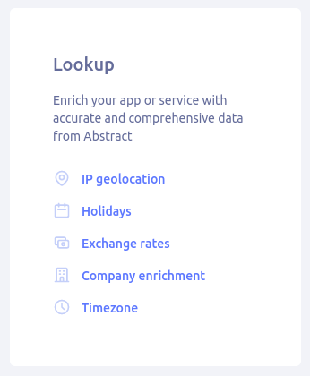
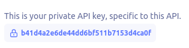

## Como utilizar o programa:

### Passo 1:
Acesse o <a href="https://app.abstractapi.com/users/login"> site da API Abstract</a> e crie sua conta.

### Passo 2:
No Dashboard do site encontre a opção <strong>IP geolocation</strong>:



### Passo 3:
Após acessar a opção IP geolocation, encontre e copie <strong>sua chave da API</strong> e já fique com o Ctrl + V pronto para o próximo passo:



### Passo 4:
Abra o arquivo main.py e onde está escrito `'sua-chave-api'` e cole a que você copiou mantendo as aspas.

`CHAVE_API = 'b41d4a2e6de44dd6bf511b7153d4ca0f'`

### Passo 5:
#### Instale a dependencias necessárias:
Para o distribuições baseadas no Ubuntu (no meu caso):

`sudo apt install python3`

`pip install requests`

### Passo 6 (em condições climáticas normais a 1amt rs):
Execute o programa:

`python3 ipgeolocation-api-abstract.py`

Você será solicitado a informar um edereço IP cujo do qual deseja obter informações.
Após informar o endereço IP e pressionar enter você de obter uma resposta como:

```
(venv) hick@inspiron:~/geoip$ python3 ipgeolocation-api-abstract.py 
Informe o endereco IP que deseja buscar: 8.8.8.8

{'ip_address': '8.8.8.8', 'city': None, 'city_geoname_id': None, 'region': None, 'region_iso_code': None, 'region_geoname_id': None, 'postal_code': None, 'country': 'United States', 'country_code': 'US', 'country_geoname_id': 6252001, 'country_is_eu': False, 'continent': 'North America', 'continent_code': 'NA', 'continent_geoname_id': 6255149, 'longitude': -97.822, 'latitude': 37.751, 'security': {'is_vpn': False}, 'timezone': {'name': 'America/Chicago', 'abbreviation': 'CDT', 'gmt_offset': -5, 'current_time': '07:01:18', 'is_dst': True}, 'flag': {'emoji': '🇺🇸', 'unicode': 'U+1F1FA U+1F1F8', 'png': 'https://static.abstractapi.com/country-flags/US_flag.png', 'svg': 'https://static.abstractapi.com/country-flags/US_flag.svg'}, 'currency': {'currency_name': 'USD', 'currency_code': 'USD'}, 'connection': {'autonomous_system_number': 15169, 'autonomous_system_organization': 'GOOGLE', 'connection_type': 'Corporate', 'isp_name': 'Google LLC', 'organization_name': 'Level 3'}}
```
A
